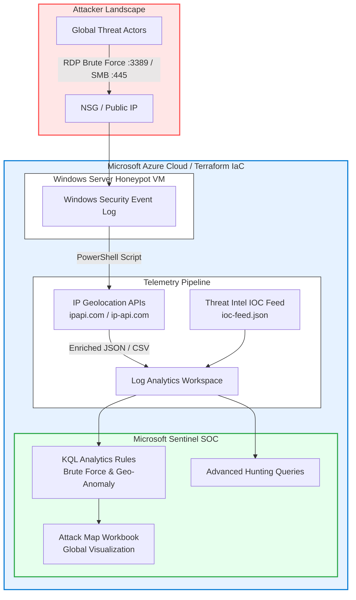

# Azure Sentinel Cloud Honeypot & Threat Intelligence Platform


A production-grade cloud security telemetry pipeline and SIEM honeypot built on **Microsoft Azure**. This project deploys an exposed Windows virtual machine acting as a honeypot, extracts real-time failed Windows logon events (Event ID 4625), enriches them with geolocation intelligence via redundant IP APIs, ingests them into **Microsoft Sentinel**, correlates against threat intelligence IOC feeds, and visualizes global brute-force attacks through custom KQL analytics rules, threat hunting queries, and interactive Sentinel Workbooks.

---

## 🏛️ Architecture



---

## 🚀 What This Project Does

1. **Exposes a Controlled Honeypot**: Deploys an Azure Windows VM with an open Network Security Group (NSG) on port 3389 (RDP) and 445 (SMB) to naturally attract brute-force attempts, credential stuffing, and unauthorized reconnaissance scans from global threat actors.
2. **Automated Log Extraction & Geo-Enrichment**: Executes a robust PowerShell automation pipeline (`ingest-geo.ps1`) that parses local Windows Security Event logs (Event ID 4625), queries multi-source IP geolocation intelligence APIs with automatic failover and rate-limiting, and structures the output into enriched CSV and JSON payloads.
3. **Enterprise Infrastructure as Code (Terraform)**: Provides a modular Terraform configuration (`terraform/main.tf`) for rapid, repeatable, and production-ready provisioning of the entire Azure resource stack.
4. **Automated CI/CD & Unit Testing**: Features a comprehensive GitHub Actions CI pipeline (`workflows/ci-pipeline.yml`) that validates KQL syntax, lints Terraform/ARM templates, and runs pytest test suites (`tests/test_ingest.py`) verifying parser logic and API mocking.
5. **Threat Intelligence Correlation**: Integrates a curated IOC threat feed (`threat-intel/ioc-feed.json`) containing known malicious IPs, Tor exit nodes, and C2 domains for automated correlation in Microsoft Sentinel.

---

## 📋 Step-by-Step Deployment Guide

### Prerequisites
- An active **Microsoft Azure Subscription**.
- Azure CLI installed and authenticated (`az login`).
- Terraform >= 1.3.0 installed.
- PowerShell 7+ for running ingestion scripts.

### Option A: Deploy via Enterprise Terraform (Recommended)
```bash
cd terraform/
terraform init
terraform plan -out=tfplan
terraform apply tfplan
```

### Option B: Deploy via ARM Template
```bash
az group create --name rg-sentinel-honeypot-prod --location eastus
az deployment group create \
  --resource-group rg-sentinel-honeypot-prod \
  --template-file deploy/azuredeploy.json \
  --parameters adminUsername="honeypotAdmin" adminPassword="ComplexPassword123!"
```

### Step 2: Configure Sentinel Data Connectors & Analytics
1. Navigate to the Azure Portal and open your deployed **Microsoft Sentinel** instance.
2. Enable the **Security Events** data connector to collect Windows Event ID 4625.
3. Import the KQL detection rules located in `kql/` into Sentinel **Analytics**.
4. Import threat indicators from `threat-intel/ioc-feed.json` into Sentinel **Threat Intelligence**.
5. Deploy the Attack Map Workbook from `workbooks/attack-map-workbook.json`.

### Step 3: Run Unit Tests & Ingestion Pipeline
To execute the Python unit tests verifying parser and geo-enrichment logic:
```bash
pytest tests/
```

To execute the PowerShell ingestion script:
```powershell
powershell -ExecutionPolicy Bypass -File .\ingest-geo.ps1 -LookbackHours 24 -OutputFolder ".\output"
```

---

## 📊 Sample KQL Queries

### 1. Brute-Force Threshold Alert (>10 failures in 5 minutes)
```kusto
SecurityEvent
| where EventID == 4625
| summarize FailureCount = count(), TargetAccounts = make_set(TargetUserName), IpAddresses = make_set(IpAddress) by IpAddress, bin(TimeGenerated, 5m)
| where FailureCount > 10
| extend AttackingIP = IpAddress
| project TimeGenerated, AttackingIP, FailureCount, TargetAccounts
| sort by FailureCount desc
```

### 2. Threat Intelligence IOC Match Query
```kusto
CommonSecurityLog
| join kind=inner (
    ThreatIntelligenceIndicator
    | mv-expand NetworkIP
    | project NetworkIP, ThreatType, Description
) on $left.SourceIP == $right.NetworkIP
| project TimeGenerated, SourceIP, ThreatType, Description, LogSeverity
```

---

## 🛡️ MITRE ATT&CK Mapping

| Technique ID | Tactic | Description | Detection KQL / Rule |
| :--- | :--- | :--- | :--- |
| **T1110.001** | Credential Access | Brute Force: Password Guessing | `brute-force-detection.kql` (>10 failures / 5m) |
| **T1078** | Defense Evasion / Initial Access | Valid Accounts: Default Accounts | `hunting-queries.kql` (Off-hours / unusual source) |
| **T1110.003** | Credential Access | Password Spraying | `hunting-queries.kql` (Same password, multi-accounts) |
| **T1589.001** | Reconnaissance | Gather Victim Identity Info | Target account enumeration via Event ID 4625 |
| **T1588.005** | Resource Development | Obtain Capabilities: Indicators of Compromise | Threat Intel matching via `ioc-feed.json` |

---

## 🧰 Technologies Used

-  **Microsoft Azure** (Virtual Machines, NSGs, Virtual Networks)
-  **Terraform** (Infrastructure as Code)
-  **Microsoft Sentinel & Log Analytics** (SIEM, Threat Intel, Workbooks)
-  **GitHub Actions CI/CD** (Automated validation & linting)
-  **Python / PyTest** (Unit testing & API mocking)
-  **PowerShell 7** (Log parsing, API enrichment, automation)
-  **Kusto Query Language** (Threat hunting, analytics, telemetry filtering)

---

## 👨💻 Author

**Ajit Nayak**  
*Cybersecurity Aspirant & SOC Analyst*  

- Portfolio: [ajit028.github.io](https://ajit028.github.io)
- LinkedIn: [linkedin.com/in/ajit028](https://linkedin.com/in/ajit028)
- GitHub: [github.com/ajit028](https://github.com/ajit028)

---

## 📄 License

Distributed under the **MIT License**. See `LICENSE` for more information.
